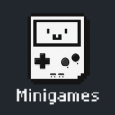
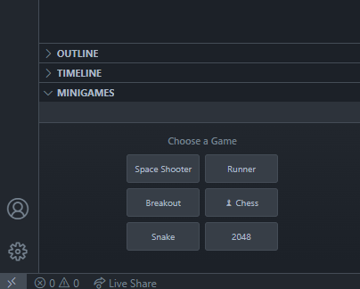
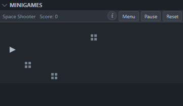
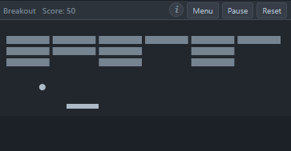
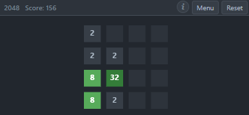

  

# Minigames

Six classic mini games (Space Shooter, Runner, Breakout, Chess, Snake, 2048) you can play right inside VS Code in a compact sidebar view that fits perfectly next to your editor!

## What you get

- 🎮 **Six games**: Space Shooter, Runner, Breakout, Chess, Snake, 2048
- 📊 **Score tracking** and quick restart
- ⏸️ **Pause/Resume** with Escape
- 🧭 **Works in the sidebar**; you can move it anywhere

## Screenshots

  
   
  <em>Main menu</em>

  
  
  

  
  
  

## Install

### From the Extension Store (recommended)

- **VS Code**:
  1. Open the Extensions view (Ctrl+Shift+X).
  2. Search for "Minigames" by **marcosbuilds**.
  3. Click **Install**. Restart if prompted.

### Install from a VSIX file (offline/manual)

1. Open the Extensions view (Ctrl+Shift+X).
2. Click the "…" menu in the top-right and choose **Install from VSIX…**.
3. Select the `.vsix` file (e.g., `minigames-0.0.1.vsix`).

## Open the games

- The Minigames view appears in the **Explorer** sidebar by default.
- If you don’t see it, open the Explorer (Ctrl+Shift+E) and look for **Minigames**.
- Or run the command: **Show Minigames** (Ctrl+Shift+P → "Show Minigames").
- You can drag the Minigames view to other panels (e.g., next to chat) and it will auto-resize.

## How to play

- **Menu**: Pick any game from the grid.
- **Pause/Resume**: Press Esc.
- **Reset**: Click Reset to restart the current game.

### Controls at a glance

- **Space Shooter**: Move with your mouse, click to shoot
- **Runner**: Press Spacebar to jump
- **Breakout**: Move the paddle with your mouse
- **Chess**: Click a piece, then click a highlighted square
- **Snake**: Arrow keys or WASD to steer
- **2048**: Arrow keys or WASD to slide tiles

## Tips

- You can move the Minigames view anywhere — right-click its title or drag it to another area.
- If a game looks cropped, expand the panel; the layout adapts to the available space.

## Troubleshooting

- **Panel won’t move?** Right-click the Minigames title and use the Move options, or drag it to another panel.

## Compatibility

- **VS Code 1.74.0+**

## License

MIT

## Feedback

Found an issue or have a suggestion? Open an issue on the project homepage.
